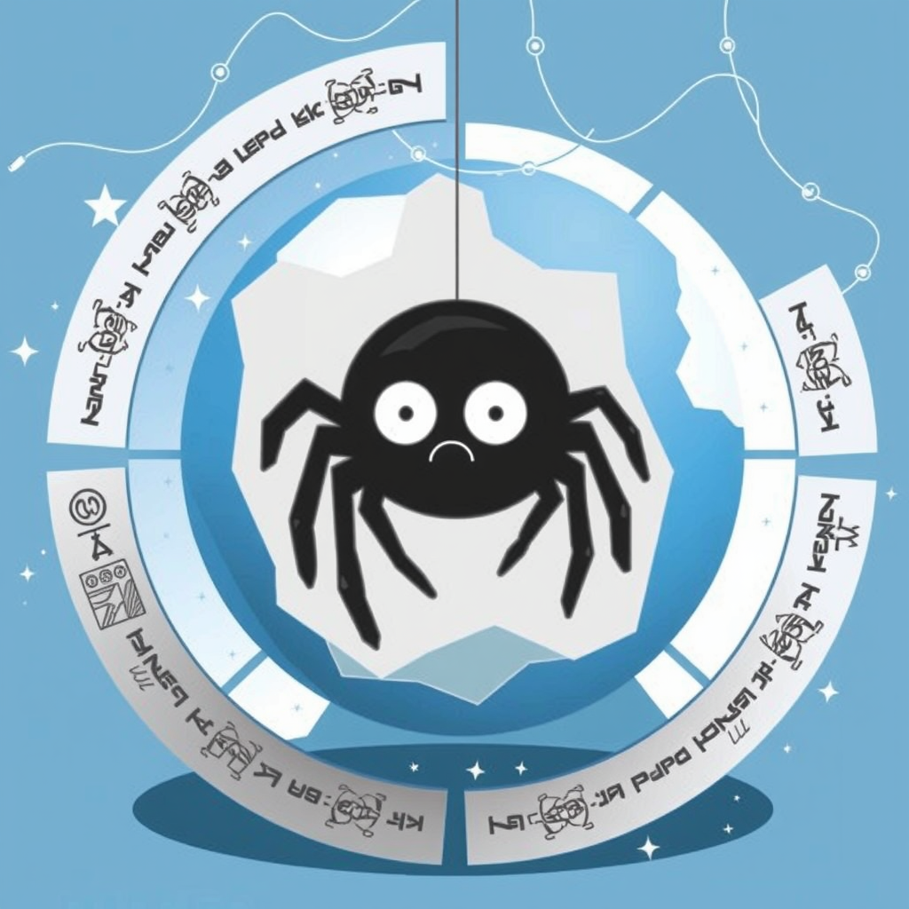
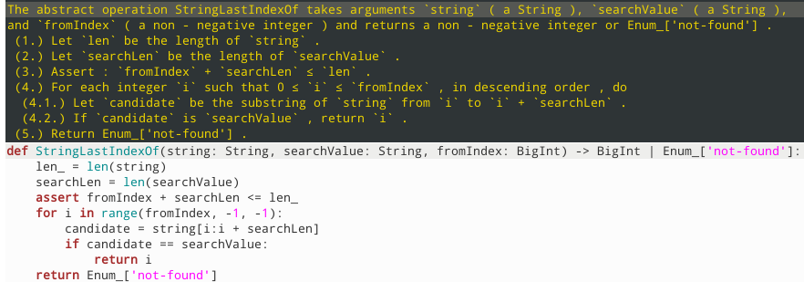

# jilliterate
Javascript engine made by LLM interpreting the ECMA specification



Status: **alpha**.

## What?

ECMA specification [https://tc39.es/ecma262/] consists of "algorithms" in informal but pedantic structured English language.
As an experiment, I tried to feed it to LLM. The result surpassed my expectations.



## Which?

I get the best results with Mistral (namely codestral) [https://mistral.ai/].

I also tried Qwen run locally through Jan.ai [https://jan.ai/]. Qwen has a tendency to chat, that means it generates
human-readable output instead of Python code.

Gemma through Groq [https://groq.com/groqcloud/] is the fastest model but makes syntax errors and can't understand some instructions.


## How?

First, check out the repository.
Then run the download script, that will download ECMA spec and convert it to XML.

`./download.py`

Then run the specification script that will convert it to a Python pickle format.

`./specification.py`

Then configure your favourite LLM platform. Provide the URL to OpenAI-compatible endpoint and export the API key. Then test it.

```
export LLM_API_URL=https://api.mistral.ai/v1
export LLM_API_KEY=<your API key>
export LLM_MODEL=codestral-latest
export LLM_CONFIG_EXTRA="{}"

./codegen.py
```

The script will generate some algorithms. Check if they are right. You may put the environment variables to the file `my_platform.sh` and source it. Always make sure the file is in `.gitignore`. Do not commit your API keys.

Finally, generate the interpreter.

`./generate.py`

Note that this will take several hours and will likely deplete your token limit.

Now go to `gencode` directory and run each file through Python interpreter to check for syntax errors.

```
cd gencode
python3 ./ao_library.py
python3 ./early_errors.py
python3 ./evaluate.py
python3 ./sdo_library.py
```

Now go an implement the backend, that is EBNF parser and all internal structures and you have the Javascript engine.

## So what?

With a little help from human devs, we could have a working Javascript interpreter that will beat Chrome and end Google's monopoly.

LLMs could be a whole new paradigm in programming, a level above programming languages, just like high-level languages are a layer
above assembler.

I see similar projects implementing applications that have a formal specification, especially interpreters and web standards.

## Contribute

If you wish to contribute, try the following:

1. Find more LLM platforms and test if they work.
2. Modify the prompt, especially to fix syntax errors.
3. Try fine-tuning the model.
4. Implement EBNF grammar parser with all necessary features needed by Javascript. Try doing it by constructing a prompt for AI.
5. Implement all the backend structures referenced by the ECMA grammar by feeding pieces of the spec into AI.
6. Make a better logo (AI-generated images preferred.)

Also look at my other project, an SVG-first web browser: [https://github.com/haael/guixmpp].

## Help

Sponsor me, as I need to pay for Mistral!

[https://github.com/sponsors/haael]

